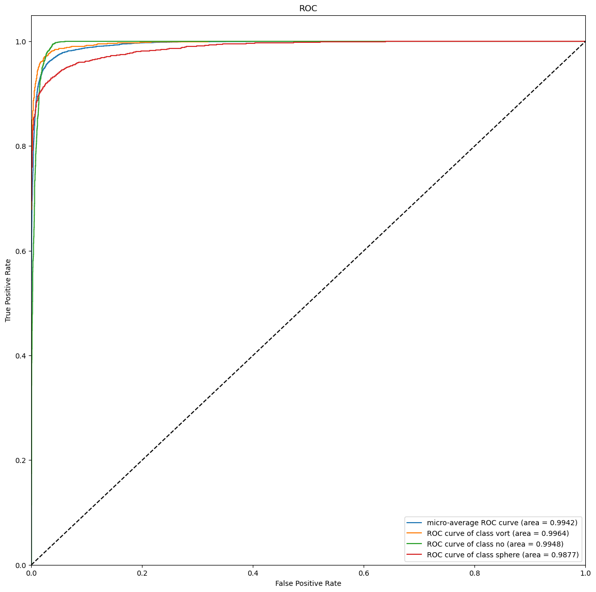

# Challenge - Multi-Class Classification 

Gravitational lensing has been a cornerstone in many cosmology experiments and studies since it was discussed in Einstein’s calculations back in 1936 and discovered in 1979, and one area of particular interest is the study of dark matter via substructure in strong lensing images. In this challenge, we focus on exploring the potential of supervised models in identifying dark matter based on simulated strong lensing images with different substructure.

### Dataset

The Dataset consists of three classes, strong lensing images with no substructure, spherical substructure, and vortex substructure. The images have been normalized using min-max normalization.

Link to the Dataset: https://drive.google.com/file/d/1B_UZtU4W65ZViTJsLeFfvK-xXCYUhw2A/view?usp=sharing

### Evaluation Metrics

ROC curve (Receiver Operating Characteristic curve) and AUC score (Area Under the ROC Curve)

The train set is divided in a 90:10 ratio into train and validation datasets. And there is a train set provided.

Validation Accuracy: 94.83% \
Validation AUC: **0.9946**

Test Accuracy: 95.07% \
Test AUC: **0.9942**

ROC curves on testing data

Tracking the metrics on Weights and Biases: wandb.ai/yogesh174/deeplense-common-test/runs/sbf2383f

