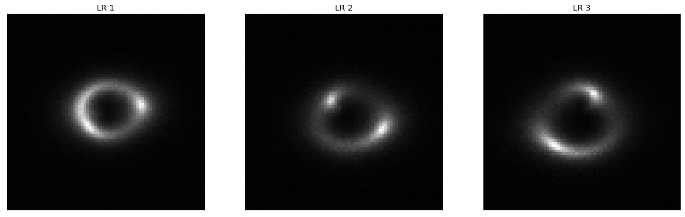
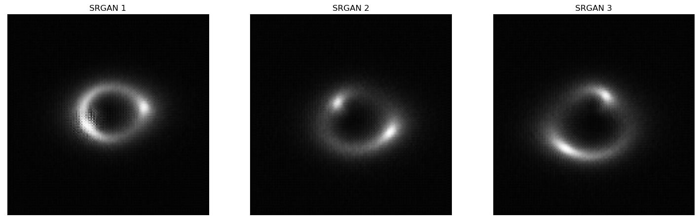

# Challenge - Image Super Resolution 

Gravitational lensing has been a cornerstone in many cosmology experiments and studies since it was discussed in Einstein’s calculations back in 1936 and discovered in 1979, and one area of particular interest is the study of dark matter via substructure in strong lensing images. In this challenge, we focus on upscaling low-resolution strong lensing images using a deep learning based super resolution algorithm.

### Dataset

The dataset comprises strong lensing images with no substructure at multiple resolutions: high-resolution (HR) and low-resolution (LR).

Link to the Dataset: https://drive.google.com/file/d/1nm_4qEHQ0iSKnpPT3hu1i0fNuTpUx-J8/view?usp=sharing

### Evaluation Metrics

MSE (Mean Squared Error), SSIM (Structural Similarity Index), PSNR (Peak Signal-to-Noise Ratio)

The given dataset is divided into 80% of training samples, 10% of validation samples and 10% of test samples.

Validation MSE: 0.000234
Validation PSNR: 36.65
Validation SSIM: 0.974

Test MSE: 0.000230
Test PSNR: 36.70
Test SSIM: 0.974

Low Resolution images

SRGAN generated images

High Resolution images

Track the metrics on Weights and Biases: https://wandb.ai/yogesh174/deeplense-sr-test/runs/vlhi51xt

### Model

I implemented SRGAN (Super Resolution Generative Adversarial Network) [[1]](#1) which is a deep learning-based image super-resolution algorithm to generate high-resolution images from low-resolution input images, while preserving as much detail and texture as possible. It uses a generative adversarial network (GAN) architecture consisting of a generator network and a discriminator network. The generator network is responsible for upsampling the low-resolution input images to high-resolution images, while the discriminator network tries to distinguish between the generated high-resolution images and real high-resolution images. During training, the generator network tries to produce images that fool the discriminator network, while the discriminator network tries to correctly distinguish between the generated images and real images. It also uses a content loss and an adversarial loss. The content loss encourages the generator network to produce high-resolution images that are similar to the original high-resolution images, while the adversarial loss encourages the generator network to produce high-resolution images that are indistinguishable from real high-resolution images. The trained model weights can found at - https://drive.google.com/drive/folders/15ILtGDs6ZaMhs8mgq8lsyA-u0t8ZonWC?usp=sharing

### References
<a id="1">[1]</a> C. Ledig et al., "Photo-Realistic Single Image Super-Resolution Using a Generative Adversarial Network," 2017 IEEE Conference on Computer Vision and Pattern Recognition (CVPR), Honolulu, HI, USA, 2017, pp. 105-114, doi: 10.1109/CVPR.2017.19.