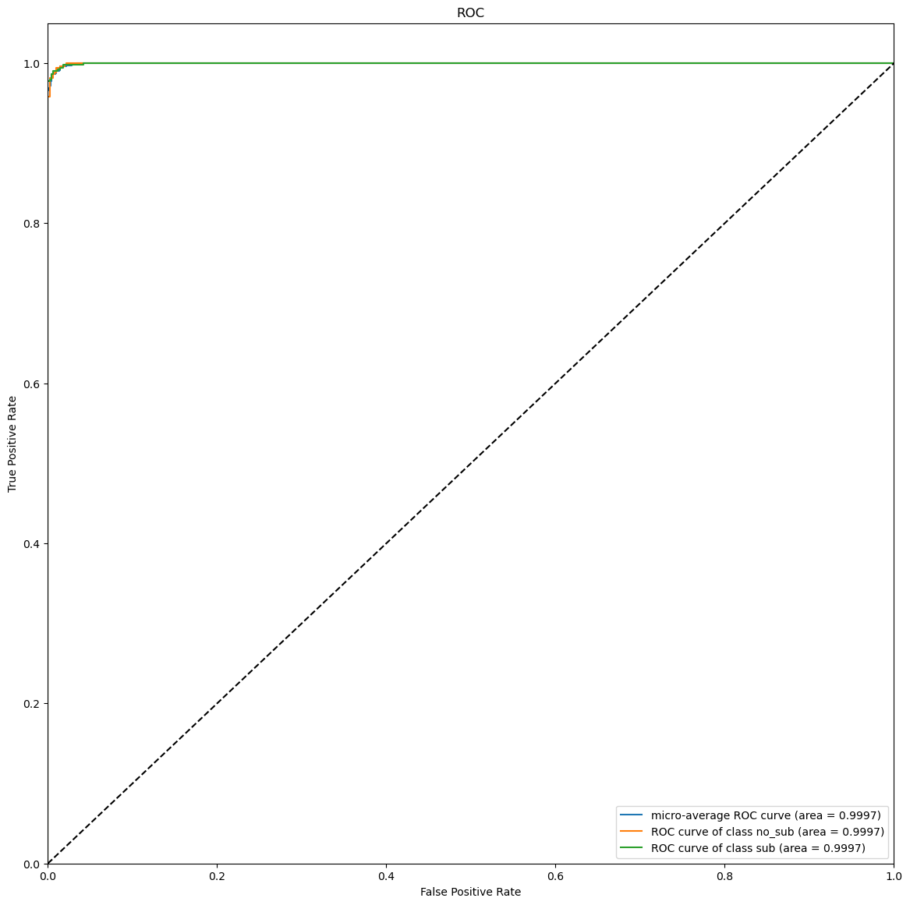

# Challenge - Exploring Transformers

Gravitational lensing has been a cornerstone in many cosmology experiments and studies since it was discussed in Einstein’s calculations back in 1936 and discovered in 1979, and one area of particular interest is the study of dark matter via substructure in strong lensing images. In this challenge, we focus on using a vision transformer to build a robust and efficient model for binary classification between lensing images with and without substructure.

### Dataset

A set of simulated strong gravitational lensing images with and without substructure.

Link to the Dataset: https://drive.google.com/file/d/16Y1taQoTeUTP5rGpB0tuPZ_S30acvnqr/view?usp=sharing

### Evaluation Metrics

ROC curve (Receiver Operating Characteristic curve) and AUC score (Area Under the ROC Curve)

The given dataset is divided into 80% of training samples, 10% of validation samples and 10% of test samples.

Validation Accuracy: 99.80% \
Validation AUC: **1.00**

Test Accuracy: 99% \
Test AUC: **0.9997**

ROC curves on testing data:

Tracking the metrics on Weights and Biases: https://wandb.ai/yogesh174/deeplense-transformers-test/runs/84ww20jp

### Model

I initially tried vanilla ViT model (with and without pretrained weights) which did not perform that well. The rate of improvement was slow even after changing parameters like learning rate and batch size. Then I used CoaT [[1]](#1) which showed some excellent results. The trained model weights can found at - https://drive.google.com/file/d/11Ks8lg-R0hkz3PQGh12bFeG0PKSd7BHd/view?usp=sharing

### References
<a id="1">[1]</a> W. Xu, Y. Xu, T. Chang and Z. Tu, "Co-Scale Conv-Attentional Image Transformers," 2021 IEEE/CVF International Conference on Computer Vision (ICCV), Montreal, QC, Canada, 2021, pp. 9961-9970, doi: 10.1109/ICCV48922.2021.00983.